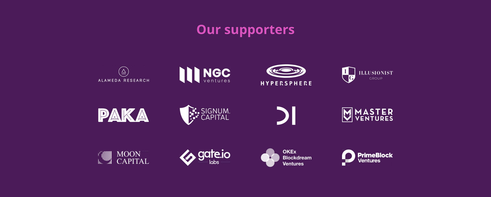
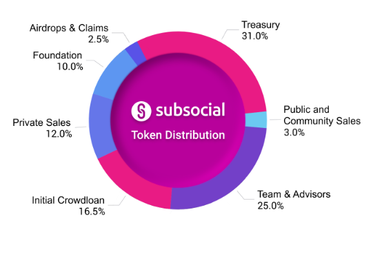
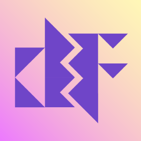

# **The Benefits of Disrutping Social Media Platforms** 
<!--Title of Specific Distruptive Technology Topic-->
_____
## _What's Subsocial?_

<!--Curious_Call_to_action-->
___
>" Subsocial **ISN'T** a decentralized social network its a platform that allows anyone to build social networks." (subsocial)
<!--Describition of what the technology is not by descibing it's general use case.-->

<!--html image showing emblem of disruptor-->

Subsocial allows its content creators to create censorship-resistant versions of today’s most used social networks such as Medium, Twitter, Reddit, Instagram, and more. Subsocial is built with IPFS (Interplanetary File System) for decentralized storage and Substrate, a modular framework written in the programming language of rust that prioritizes memory safety and performance. Using Substrate also allows the Subsocial network to connect to the Polkadot and Kusama networks and their next-generation blockchain protocols that host their network of purpose-built parachains. Kusama and Polkadot protocols provide cross-chain interactions and shared security which allows the protocol to scale seamlessly.

<!--brief overview of what the tech isn't and how it can used, what technologies does it use to accomplish it's Goal or what makes the brand/company different from most.-->
### Contributors & Investors
___________

 Early contributors helped Subsocial form by particapating in what is called a crowdloan, which is specific to the Polkadot & Kusama parachain ecosystem. A crowdloan is a way for projects to anticipate the support they need to connect to Kusama & Polkadot networks as a parachain. Crowdloan particatipants lock a minimum stake to be bonded to the Kusama or Polkadot and in return are rewarded with the native token of the parachain. Subsocial rewarded early investors by giving them a greater percentage of tokens, they also recieved venture capital from multiple firms. (see below) 

<!--Facts about who contributed to the company's/disruptor's success and what resulted from their contributions.-->

## Who built subsocial?
Dappforce is the team behind the creation of the Subsocial chain. Dappforce were one of many teams that recieved a Web3 grant to help bootstrap their project.
_____________

This is far more than a content-sharing platform with monetization abilities. Subsocial is enabling Social Finance this is where social media meets decentralized finance. Subsocial relieves Creators of having to worry about the platform censoring or even banning them from the platform based on something a centralized algorithm deemed inappropriate. The protocol being a decentralized protocol enables the ability to provide a peer-to-peer economy which means 100% of your donation goes to your favorite content creators with no need for an intermediary platform,  it also avoids having platform users reregister and create multiple accounts resulting in multiple siloed accounts between social networking platforms. Subsoical gives social networking platforms a much-needed reframing by putting self-moderation over censorship and empowering Peer-to-Peer feeless monetization over hefty hosting platform fees, Subsocial remedies closed network effects with what is called a knowledge graph ( think of this as all of your photos, videos, posts, friends, post history) this means no need to repetitively make new accounts when visiting a new site for the first time, your graph follows you due to Kusama’s shared or open network affects a benefit the Web3 protocol Subsocial posessess over modern day social network platforms. 

<!--Brand Statement-->

## Social Ecosystems of the Day: Censorship, Monetization, Silos
__________
> 3 problem areas Subsocial looks to correct:
1. Censorship 
    * Twitter suspened over 1 million accounts in the first half of 2022.
    * Centralized algorithms that tend to show upsseting to harvest application users time and attention.
2. Siloed User 
    * Users don't own their data so that can not take their social graph with them if they leave the platform. 
3. Monetization
    * Google makes 200 dollars annually per user by selling their data to the highest bidder.
    * _" Youtube monetization model rewards creators with a maximum of $2 - $12 dollars per 1000 views, $120 - $800 per 100,000 views and $1,2000 - $6,000 per 1,000,000 views. "_

<!--List of Inefficiencies the technology attempts to capitalize on.-->

<!--Facts about how technology can and does solve financial inefficiencies.-->

### Deepdive
____________

 Dappforce the team behind the development of the Subsoical network implemented what they call “Spaces”. Spaces can be compared to channels on YouTube or accounts, pages, or groups on Facebook. They also have “Posts” that are like Twitter tweets or Medium articles. All posts and spaces are associated with a user’s public key pairs or accounts. Subsocial using IPFS allows for the creation of a CID which is like directions that help find a file, this is most useful when uploading content to space via a post. If a user has access to the public key pair, they can prove they have ownership of their content, data, and funds associated with their key pair, giving individuals true ownership of when they want something publicized or monetized.

The application layer is vital to Subsoical because without its applications would not be able to utilize the Subsoical SDK which allows space owners to filter out what content they want to be displayed in their space. Every app on the Subsocial network receives access to its full content and userbase speeding up the launch process of a new app and allowing creators to focus on providing their followers with the best content possible. This also allows for creators to focus on ways to monetize to the end user with a multitude of methods including subscriptions, selling, or renting their space or posts, Tokenize your space and start distributing tokens to your followers (users), creators can even deploy smart contracts to Subsoical to make use of what the team at Dappforce call social-finance primitives.

In Subsocial creators become owners of their space and their followers can become co-owners of that space choosing and allowing governance of each space evolve. There is also a governance layer for the protocol as well through which chain upgrades are decided and how treasury funds get spent or if subsocial should integrate with other social networks or chains. Subsocial address the issues of censorship, monetization and siloed users by giving creators and communitites owner ship rights by tokenizing they're space which gives them the ability to monetize, moderate and access their posts, space and govern how that space evolves over time.

## Resources
_____________
* Token Dist ( https://docs.subsocial.network/docs/basics/tokenomics/token-distribution )

* Token Econ (https://docs.subsocial.network/docs/basics/tokenomics/token-economics) 

* Subsoical R&P (https://docs.subsocial.network/docs/basics/lightpaper/architecture/roles-and-permissions) 

* Subsocial Pod (https://relaychain.fm/39-building-blockchain-social-networks-with-subsocial) 

* Subscoial Network (https://subsocial.network/) 

* Kusama Network (https://guide.kusama.network/) 

* Polkadot Network (https://polkadot.network/) 

* Dappforce (https://github.com/dappforce) 

* Subsocial.vid (https://www.youtube.com/watch?v=58QuLi9ff9g)
